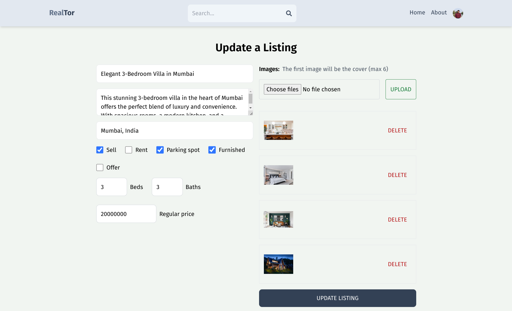

# Live app - https://realtor-akaj.onrender.com/


# RealTor - A Real Estate App

"RealTor" offers a comprehensive real estate platform that allows users to manage their property listings and interact with potential buyers or renters seamlessly. The tech stack ensures a robust and scalable application, while the features provide a user-friendly and efficient experience for both property owners and those seeking real estate opportunities.

**Tech Stack:**

-   Backend: Built with Express.js for server-side logic.
-   Database: MongoDB Atlas is used to store and manage data.
-   Storage: Firebase is employed for storing images and files.
-   Frontend: Developed using React and Vite for efficient rendering and user interface.
-   Authentication: Offers both traditional email/password login and sign-in with Google OAuth.

**Key Features:**

1. **User Authentication:**

    - Users can sign up with email and password.
    - Alternatively, they can use Google OAuth for quick registration.
    - Secure user login with or without Google authentication.

2. **Listing Management:**

    - Users can create detailed property listings.
    - Property details include name, description, address, rent/sale option, number of beds and baths, parking availability, and furnished status.
    - Users can set both regular and offer prices.
    - Up to 6 images of the property can be uploaded for a visual representation.

3. **User Profile Management:**

    - Users can edit their username, email, and password.
    - They can also update their avatar for a personalized profile.

4. **Listing Operations:**

    - Users have full control over their listings.
    - They can create, update, and delete property listings.

5. **Account Management:**

    - Users can delete their account if they choose to do so.
    - Secure sign-out option is available to ensure data privacy.

6. **Listing Display:**
    - Property listings are displayed with key details like name, description, address, sale price, or monthly rent, number of beds and baths, parking availability, and furnished status.
    - Users can easily contact the property owner or landlord for inquiries.

### Prerequisites

**Node version 14.x**

### Cloning the repository

```shell
git clone https://github.com/abishek-as/realtor.git
```

### Install packages

```shell
npm i
```

### Setup .env file in api folder,

```js
MONGODB_URL=
JWT_SECRET=
```

Paste the mongodb atlas URL in MONGODB_URL and Your jwt secret in JWT_SECRET

### Setup .env file in client folder,

```js
VITE_FIREBASE_API_KEY=
```

Paste the firebase api key in VITE_FIREBASE_API_KEY

### Start the server

```shell
npm run dev
```

### Start the client

```shell
cd client ; npm run dev
```

## Images

### Sign-Up page


### Sign-In page


### Sign-In using google OAuth


### User Page


### Create Listing


### Listing create by user


### Update Listing



### Listing for Rent


### Listing for Sale


### Search Page


### About page


